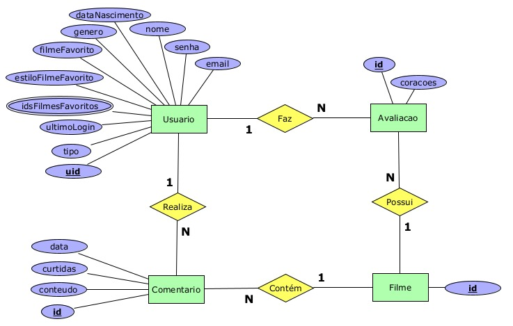
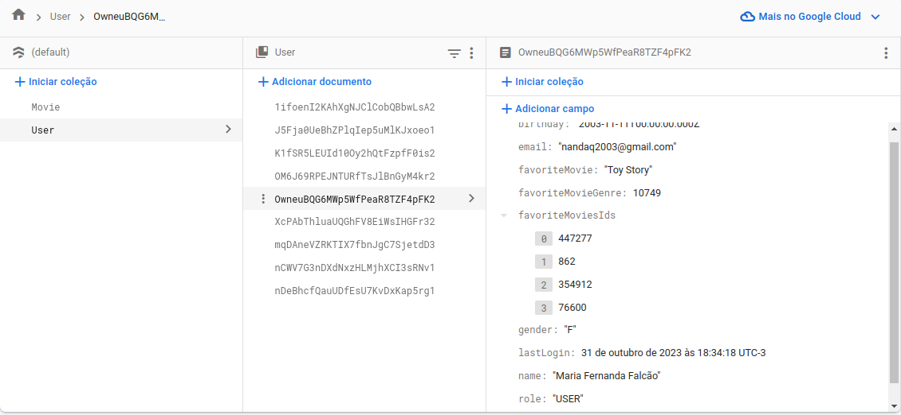
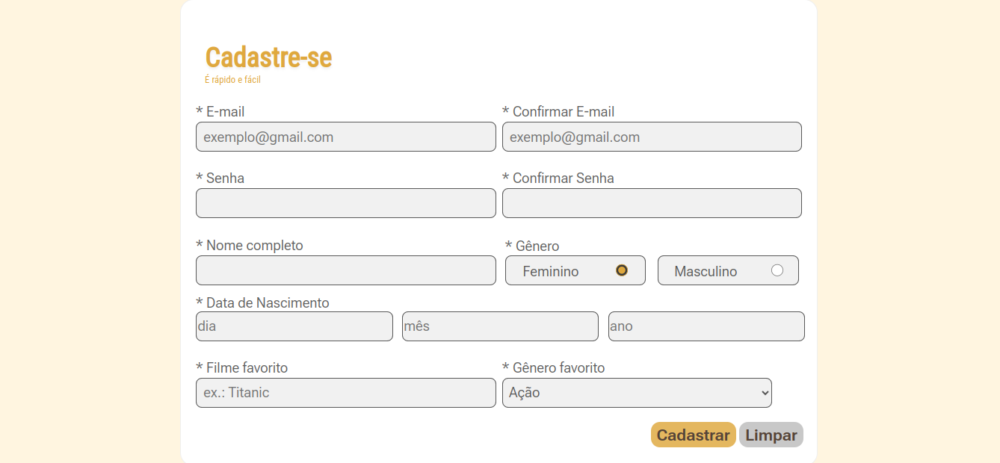
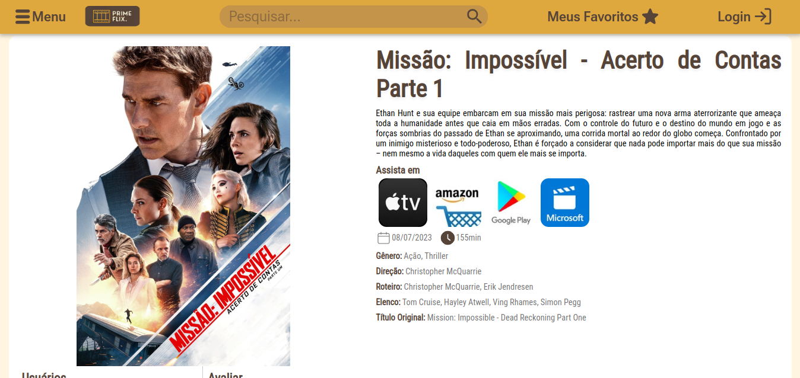
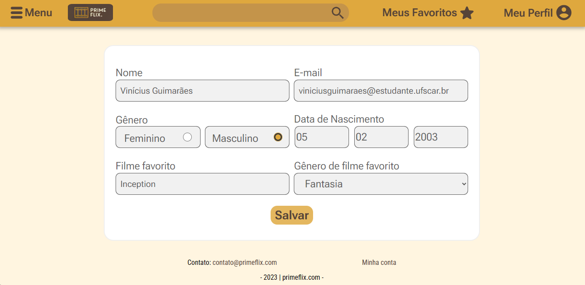
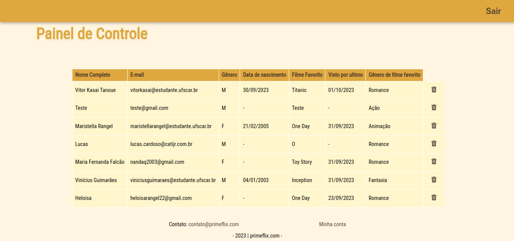

# PrimeFlix

Esse sistema tem como finalidade principal facilitar a escolha das pessoas em quais
filmes deseja assistir nos serviços de streaming, nos cinemas ou na programação da
televisão, a fim de diminuir a indecisão das pessoas e economizar tempo na escolha
do que assistir.

## Ferramentas e Tecnologias

### Backend

- NodeJS Typescript
- Sistema Firebase (Firestore e Auth Firebase)
- Fastify
- Axios
- Arquitetura MVC (model-view-controller)

### Frontend

- React TS
- React-router-dom
- Yup
- Styled Components
- CSS

### Outras Tecnologias

- TMDB API

## Banco de Dados

Neste sistema, foi utilizado um sistema de banco de dados não relacional (NOSQL), Firestore.  
Para realizar sua implementação, um diagrama foi elaborado:

Abaixo, encontra-se uma imagem do banco de dados estruturado na plataforma do Firebase:

O sistema utiliza a API do TMDB para obter informações detalhadas sobre diversos filmes. O banco de dados, por sua vez, é dedicado exclusivamente ao armazenamento de informações adicionais relacionadas aos filmes dentro do nosso sistema, como comentários e avaliações, além de dados sobre os usuários cadastrados.

Logo, não mantemos informações completas dos filmes em nosso banco de dados. A única informação que necessitamos armazenar é o ID correspondente aos filmes na API do TMDB.

## O sistema do PrimeFlix

### Tela Home

A página inicial do PrimeFlix apresenta duas versões distintas: uma versão para usuários autenticados e outra para visitantes.  
A versão autenticada inclui recursos exclusivos que serão explorados posteriormente e que só estão disponíveis com autenticação.

### Cadastro

O sistema possibilita que os usuários se cadastrem, sendo necessária a confirmação da conta por meio de um e-mail.

### Alteração de Senha

Um usuário também tem a opção de solicitar uma redefinição de senha, inserindo seu endereço de e-mail, a fim de receber um link que permitirá realizar essa ação.

### Buscas através de filtros

O sistema oferece a funcionalidade de busca de filmes, permitindo que os usuários utilizem diversos filtros, como gêneros, para refinar suas pesquisas.

### Informações detalhadas de um filme

O projeto oferece aos usuários a capacidade de visualizar informações detalhadas de um filme, como enredo, gênero, elenco, duração e diretor.

### Lista com Base no Perfil do Usuário

Dentro do sistema, encontra-se a funcionalidade da lista "Feito para você", que disponibiliza diversos filmes alinhados com o perfil do usuário. Mas como isso é feito ?

Para tornar isso possível, ocorre uma integração completa entre a tela de cadastro, o backend e a API do TMDB. Durante o processo de cadastro, o sistema requer que o usuário indique seu gênero de filme favorito, por meio de um campo SELECT, a fim de garantir que a categoria escolhida esteja presente na API do TMDB. No backend, foi implementada uma rota específica que, com base no gênero de filme favorito armazenado no banco de dados e em conjunto com a API do TMDB, retorna uma seleção de filmes relacionados àquela categoria. Desta forma, a lista "Feito para você" é personalizada de acordo com as preferências individuais do usuário, oferecendo recomendações relevantes.

### Outras Listas

Existem outras listas na aplicação, como por exemplo a “Em Cartaz” que contém somente filmes que estão em cartaz no cinema, e a “Melhores do Cinema” com os filmes que possuem maior avaliação.

### Sistema de Favoritos

O sistema inclui uma funcionalidade de lista de favoritos, permitindo aos usuários autenticados adicionar filmes do sistema a essa lista e também remover itens dela. A funcionalidade de favoritos está disponível exclusivamente para usuários autenticados no sistema.

### Comentários e Avaliações

Os usuários também têm a opção de adicionar comentários aos filmes, com a possibilidade de curtir esses comentários. Além disso, é possível realizar avaliações dos filmes.

Para disponibilizar as avaliações de cada filme, foi implementada uma funcionalidade no backend que calcula a média das avaliações para cada filme. Isso envolve a soma de todas as avaliações e a subsequente divisão pelo total de avaliações registradas no sistema. Esta rota é chamada para fornecer com precisão a média das avaliações no frontend.

## Tela do Perfil
Cada usuário consegue mudar as suas informações do perfil. Além disso, caso mude o gênero de filme favorito, a recomendação de filmes para esse usuário também é atualizada para satisfazer a mudança.

### Tela do Admin

O administrador, de acordo com as especificações do cliente, é um usuário com um perfil distinto no sistema. Isso significa que ele não possui todas as funcionalidades disponíveis para um usuário comum, sendo designado exclusivamente para gerenciar o cadastro de usuários.

O administrador realiza a autenticação da mesma forma que um usuário comum, no entanto, seu status de administrador é controlado por um atributo denominado "ROLE" dentro da entidade de usuário. Se ele for identificado como um administrador, o sistema o redireciona automaticamente da tela de login para a interface administrativa.

Na tela de administração, o administrador tem a capacidade de visualizar todos os usuários registrados no sistema e também tem a opção de remover um usuário por inatividade, com base na última vez que o usuário realizou login no sistema, por exemplo.

## Colaboradores
- Vitor Kasai Tanoue - Desenvolvedor Backend
- Vinícius Guimarães - Desenvolvedor Backend
- Lucas de Araújo Cardoso - Desenvolvedor Backend
- Nicole Correa Ramos - Prototipação e Marketing
